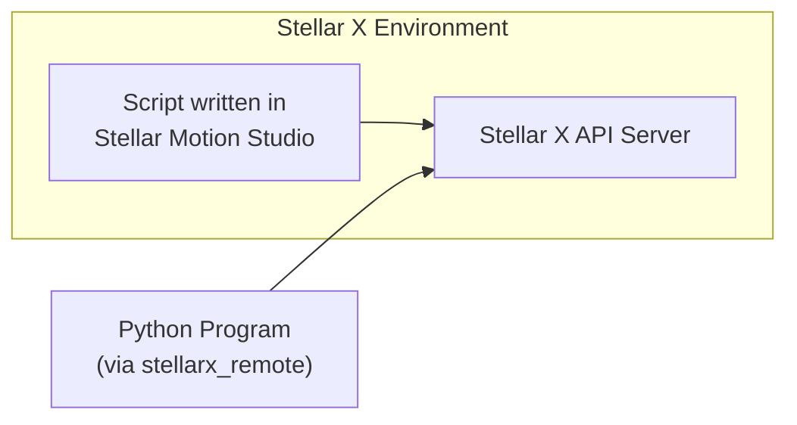

# Understanding Remote Control

## Overview

Within **Stellar Motion Studio**, users can write Python scripts directly in the Motion tab to execute robotic movements. However, this method relies on internal communication confined strictly within the Stellar X device. Because it is isolated from external networks, this internal scripting approach cannot be used when an upper-level (host) controller needs to manage Stellar X alongside other peripheral devices.

## The `stellarx_remote` SDK

To enable external integration, upper-level controllers can utilize **`stellarx_remote`**, an SDK provided by Sodero. This SDK allows external programs to issue Remote Procedure Calls (RPC) seamlessly to the Stellar X system.

You can access the official SDK repository here:  
🔗 **[Sodero-labs/stellarx_remote on GitHub](https://github.com/Sodero-labs/stellarx_remote)**

### Key Advantages

* **Unified API Experience:** Controlling the robot externally via the SDK feels incredibly familiar. You can call APIs in the exact same manner as you would use the `robot` object within the Motion tab of Stellar Motion Studio, ensuring a smooth transition from internal testing to external control.

* **Language Independence:** While the official `stellarx_remote` SDK is provided in Python, the underlying architecture handles network communication without any language restrictions. As long as your custom application adheres to the defined communication protocol, you can interface with Stellar X using any programming language of your choice.